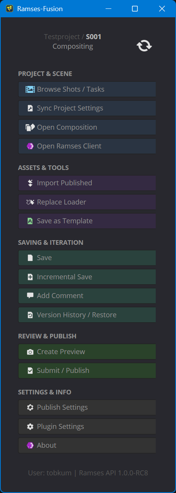

# Ramses-Fusion

**Ramses-Fusion** is a powerful integration of the [Ramses](https://ramses.rxlab.guide/) pipeline ecosystem for Blackmagic Fusion. It provides compositors with a streamlined toolset to manage shot contexts, automate scene setup, and handle publishing workflows directly within the Fusion interface.

## 🚀 Features

### Project & Scene Management
- **Open Composition:** Quickly browse and open existing Ramses-managed compositions.
- **Switch Shot:** Instantly jump between shots in your project or initialize new shots from templates without leaving Fusion.
- **Setup Scene:** Automatically configures resolution, frame range, aspect ratio, and framerate based on Ramses database settings.
- **Render Anchors:** Automated creation of `_PREVIEW` and `_FINAL` Saver nodes that automatically target the correct project paths.

### Assets & Tools
- **Import Asset:** Easily bring in published assets, renders, or cameras from other pipeline steps.
- **Replace Loader:** Swap out existing Loader nodes with different versions or entirely new assets while maintaining context.
- **Templates:** Save your current composition setup as a template to be reused across other shots in the same production step.

### Saving & Iteration
- **Versioning:** Managed incremental saves and retrieval of previous versions from the Ramses version history.
- **Metadata tagging:** Automatically associates comments and status updates with your saved files in the Ramses database.

## 🛠️ Installation

1.  **Locate your Scripts Folder:**
    *   **Windows:** `%APPDATA%\Blackmagic Design\Fusion\Profiles\Default\Scripts\Comp`
    *   **Mac/Linux:** Refer to Fusion documentation for your specific user path.

2.  **Copy Files:**
    *   Copy the `Ramses-Fusion` folder into the `Scripts/Comp` directory.
    *   The resulting structure should be: `.../Scripts/Comp/Ramses-Fusion/Ramses-Fusion.py`

3.  **Dependencies:**
    *   Requires the **Ramses Client** application to be running and logged in.
    *   Requires the **Ramses Daemon** to be reachable.

## 📖 Usage

### Getting Started
1.  Launch **Ramses Client** and ensure you are logged into your active project.
2.  Open Fusion.
3.  Navigate to `Script > Ramses-Fusion > Ramses-Fusion`.
4.  Use the **"Setup Scene"** button to align your composition with the project's technical specifications.

### Publishing a Shot
1.  Ensure your Flow contains a Saver node named `_FINAL` (automatically created and configured by the "Setup Scene" button).
2.  Click **"Update Status / Publish"**.
3.  Choose your new status (e.g., "Pending Review") and provide a comment.
4.  Check the **"Publish"** option.
5.  Ramses-Fusion will save the version, create a backup of the source `.comp`, and render the final output to the standardized project export directory.

## ⚙️ Configuration

Custom port numbers, default frame ranges, and paths can be configured in the **Plugin Settings** panel within the application.
