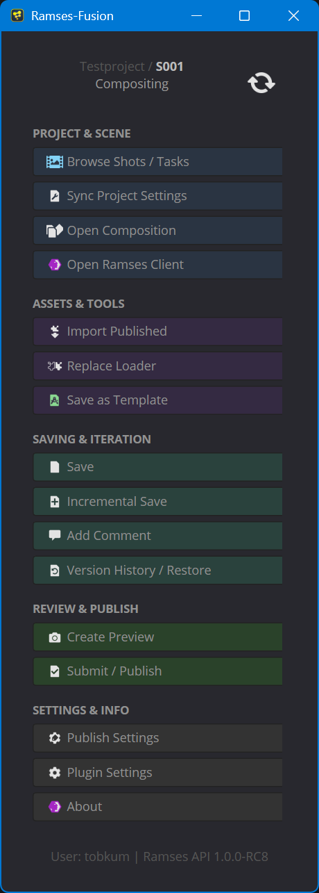

# Ramses-Fusion

Fusion Studio integration for [Ramses](https://ramses.rxlab.guide/) production management. Provides version control, asset management, and automated render path resolution directly within the Fusion compositing environment.

## Core Features

### Pipeline Integration
- **Project Browser**: Navigate project hierarchy (shots, sequences, steps) within Fusion UI
- **Context Tracking**: Automatic detection of current shot/step from open composition file path
- **Database Sync**: Live connection to Ramses Daemon for shot metadata and status updates

### Scene Setup Automation
- **Technical Spec Application**: Automatically configures composition settings from Ramses project database:
  - Resolution (width, height, aspect ratio)
  - Frame rate
  - Frame range (start, end based on shot duration)
- **Render Anchor Generation**: Creates preconfigured Saver nodes with standardized paths:
  - `_PREVIEW`: Review renders into the shot's `_preview` folder (default: ProRes 422 `.mov`, e.g. `PROJ_S_SH010_COMP.mov`)
  - `_FINAL`: Client deliverables into the project export folder (default) or the step's `_published` folder, with optional client suffix (e.g. `A010_C003_vfx.####.exr`)
  - Optional **source-plate frame numbering** for sequence deliverables: files carry the plate's original frame numbers while the comp stays at the studio start frame (see [Step Configuration](wiki/Step-Configuration.md))

### Asset Management
- **Import Published Elements**: Load upstream renders (e.g., plates from PLATE step) with automatic Loader node creation
- **Version Management**:
  - Restore previous composition versions from `_versions` folder
  - Swap Loader sources to different published versions
- **Update Detection**: Visual indicators (orange tile color) for Loader nodes referencing outdated upstream versions

### Version Control
- **Incremental Save**: Saves current composition to `_versions` folder with auto-incremented naming
- **Publish Workflow**:
  1. Validates composition against project specs (resolution, framerate)
  2. Saves versioned copy to `_published/vNNN_STATE` folder
  3. Updates Ramses database with completion status and metadata

### Status Management
- **Shot Status Updates**: Set task status (TODO, WIP, Review, Approved) directly from Fusion
- **Comment Integration**: Add production notes synchronized with Ramses database
- **Quick Preview Playback**: Side-button next to Create Preview opens the current shot's preview file in the OS default media player; enabled only when a preview already exists on disk

## Technical Details

### API Integration
- **Daemon Communication**: Thread-safe socket communication with Ramses Daemon (TCP)
- **Metadata Management**: Reads/writes `.ramses` JSON sidecar files for version tracking
- **Path Resolution**: Uses Ramses API conventions for folder structure (`05-SHOTS`, `_published`, `_versions`)

### Fusion-Specific Implementation
- **Monkey Patching**: Applies targeted fixes to Ramses API for Fusion environment compatibility:
  - Synchronous file copying (prevents Fusion UI hangs)
  - Robust version file sorting (handles folder-based versions)
  - Thread-safe daemon communication
- **UIManager Integration**: Custom dialogs using Fusion's native UI framework

### Performance Optimizations
- **Debounced Updates**: 5-second debounce on header refresh to reduce daemon queries
- **Path Caching**: Minimizes repeated file system scans for version detection
- **Outdated Loader Check**: Only runs when composition path changes (not on every UI refresh)

## Prerequisites

- **Fusion Studio** 18.x or later (Blackmagic Design)
- **Python 3.6+** (bundled with Fusion)
- **Ramses Client** with active Daemon
- **Network Access**: Shared project storage for published files

## Installation

```bash
git clone https://github.com/tobkum/Ramses-Fusion.git
cd ramses-fusion
```

Copy contents to Fusion Scripts directory:
- **Windows**: `%APPDATA%\Blackmagic Design\Fusion\Scripts\Comp\`
- **macOS**: `~/Library/Application Support/Blackmagic Design/Fusion/Scripts/Comp/`
- **Linux**: `~/.fusion/BlackmagicDesign/Fusion/Scripts/Comp/`

## Usage

### Initial Setup
1. Launch Fusion Studio
2. Access Ramses panel: `Scripts > Ramses-Fusion` (or via menu integration)
3. Connect to Ramses Daemon (automatic if Ramses Client is running)



### Typical Workflow
1. **Open/Create Shot**: Use project browser to select shot and step
2. **Setup Scene**: Click "Setup Scene" to apply project specs
3. **Import Assets**: Load published plates/renders from upstream steps
4. **Composite**: Work on shot using standard Fusion workflow
5. **Save Versions**: Incremental save creates timestamped versions
6. **Publish**: Final publish renders output and updates database status

### Render Anchor Usage
The tool creates two Saver nodes for standardized output:
- **Preview Saver** (`_PREVIEW`): Automatic path into the shot's `_preview` folder (default format: ProRes 422 `.mov`)
- **Final Saver** (`_FINAL`): Automatic path into the project export folder (default) or, with `export_dest: step`, a versioned `_published/NNN_STATE/` folder

Paths, formats and (optionally) output frame numbering are managed automatically — no manual file naming required.

## Configuration

### Step Configuration
Configure render output settings per step via Fusion UI (Render Wizard —
paste a configured Saver, no hand-written YAML needed):
- Output format (EXR, DPX, etc.)
- Color depth
- Compression
- Client suffix for deliverables (`_vfx`, `_final`, etc.)
- Export destination (project export folder or versioned `_published`)
- Source-plate frame numbering for sequence deliverables (tick *Set Sequence
  Start* on the pasted Saver)

### User Settings
Stored in the standard Ramses add-ons config (`ramses_addons_settings.json` in
the Ramses config directory, e.g. `%APPDATA%/Ramses/Config/` on Windows):
- `compStartFrame`: Default timeline start frame (e.g., 1001)
- `plateStepNames`: Step short names treated as plate/footage steps
  (default: `Plate`, `Ingest`, `Footage` — shared with Ramses-Syntheyes)

## Troubleshooting

### "Daemon not available"
- Ensure Ramses Client is running
- Check network connectivity to Ramses server
- Verify daemon port (default: 18185) is not blocked

### "Version folder not found"
- Composition must be saved within Ramses project structure
- Path must contain shot identifier matching Ramses database

### Loader nodes show orange
- Upstream published version has been updated (the node comment names the new version)
- Select the Loader and click **Replace Loader** — the plugin offers the latest published version

## Architecture

See [Technical Details](wiki/Technical-Details.md) for:
- Daemon communication protocol
- File path resolution logic
- Version detection algorithm
- Monkey patch implementations

## Contributing

See [Developer Guide](wiki/Developer-Guide.md) for:
- Code structure
- Testing procedures
- Ramses API integration points

## License

[Insert License Type]

---

Developed by [Overmind Studios](https://www.overmind-studios.de/)
